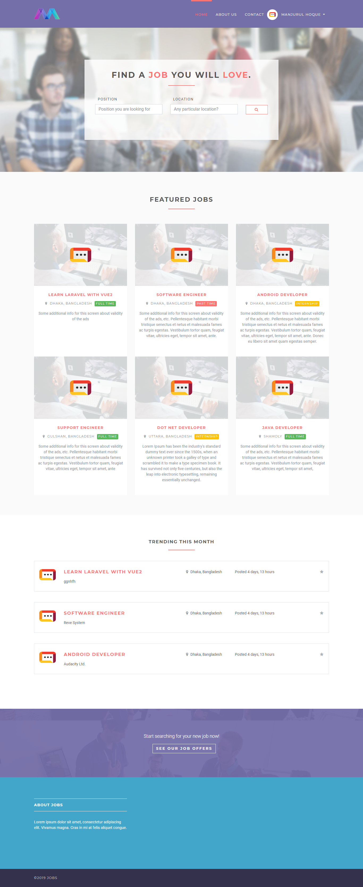
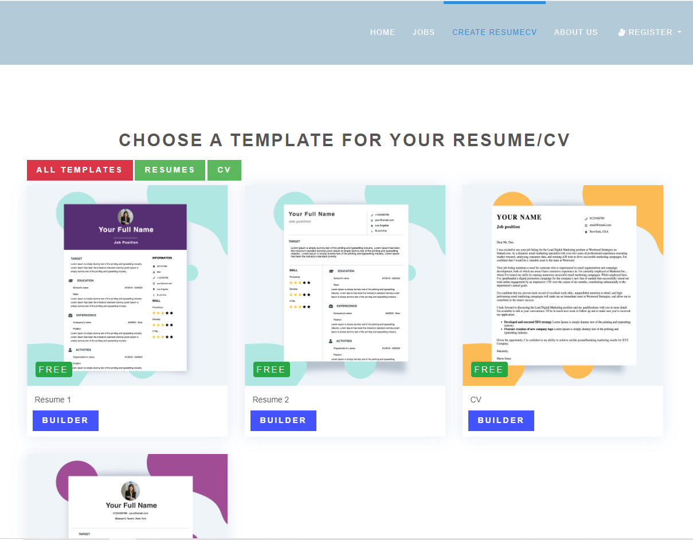
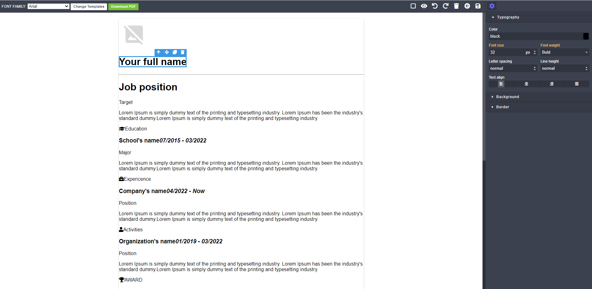
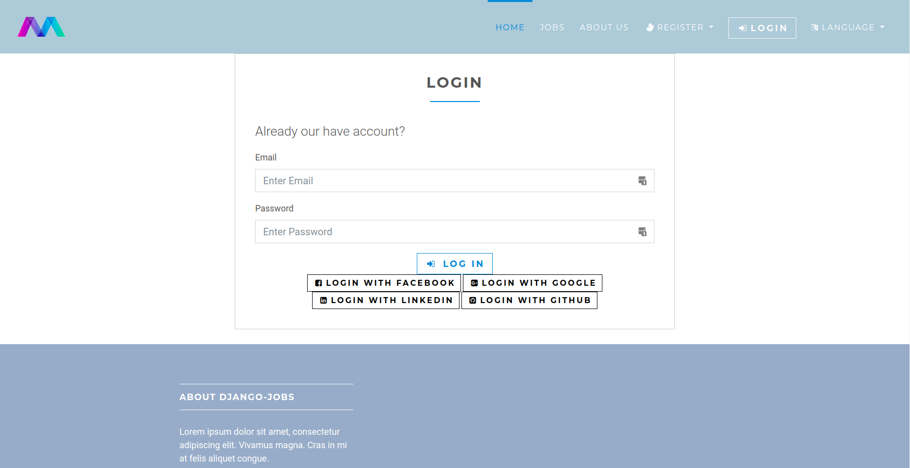
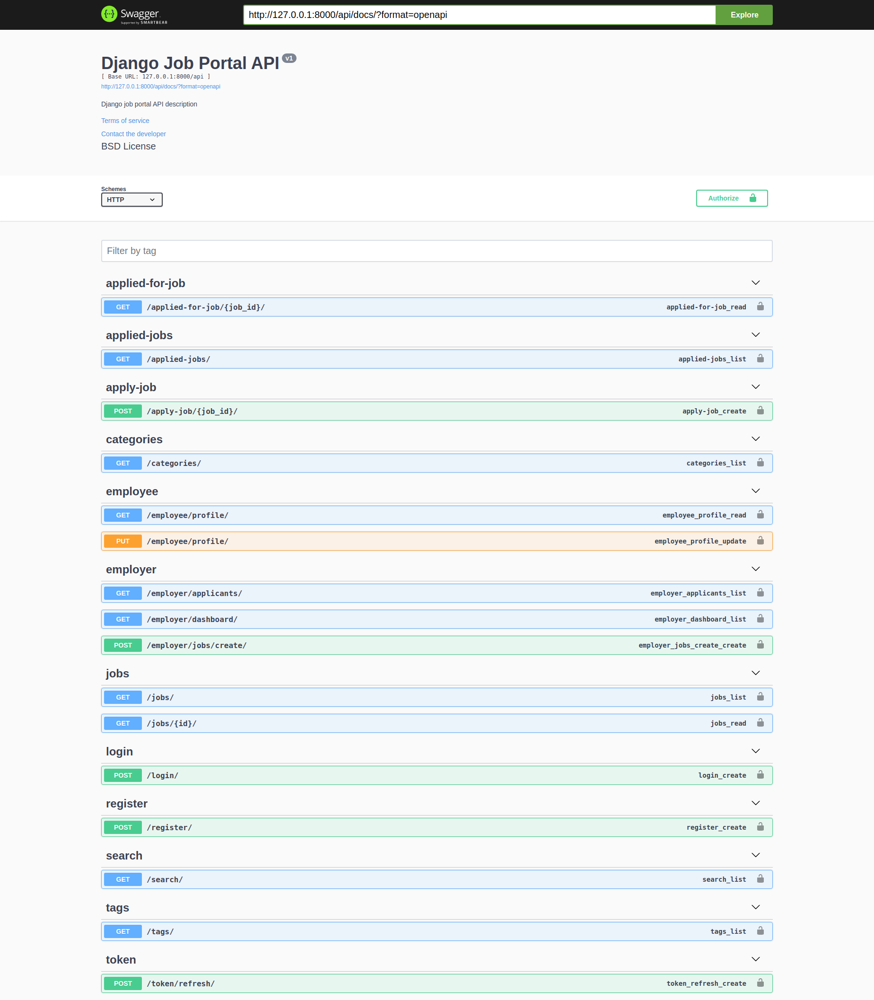

<div align="center">

# Django Job Portal

</div>

## Project Overview

The **Django Job Portal** is an open-source job portal application developed using Django. It enables users to search for job opportunities, apply for positions, and manage resumes. Employers can post job openings and view applications. The project aims to streamline the job application process and provide a user-friendly interface for both job seekers and employers.


## Technologies

- **Django:** Web framework for building the application.
- **SQLite:** Lightweight database for storing data.

## Local Environment Setup

### Installation

1. **Create a Virtual Environment**

    ```bash
    python3.8 -m venv venv
    ```

2. **Activate the Virtual Environment**

    ```bash
    source venv/bin/activate
    ```

3. **Clone the Repository and Install Dependencies**

    ```bash
    git clone <repository-url>
    cd django-job-portal
    pip install -r requirements.txt
    ```

4. **Set Up Environment Variables**

    ```bash
    cp .env.dev.sample .env
    ```
    Update `.env` with your Github client ID and client secret.

### Running the Application

1. **Collect Static Files**

    ```bash
    python manage.py collectstatic
    ```
    *Note: This step is not needed if `DEBUG=True`.*

2. **Create Initial Database**

    ```bash
    python manage.py migrate
    ```

3. **Load Demo Data (Optional)**

    ```bash
    python manage.py loaddata fixtures/app_name_initial_data.json --app app.model_name
    ```

4. **Run the Development Server**

    ```bash
    python manage.py runserver
    ```

5. **Default Django Admin Credentials**

    - **Email:** example123@gmail.com
    - **Password:** admin

### Running Tests

```bash
python manage.py test
```
## Screenshots

**Home Page**


**Resume Template Page**



**Login Page**


**Add New Position as Employer**


**Job Details**


**Swagger API**

### License
This project is licensed under the MIT License.

### Author
Developed by Marcus Wilkes
